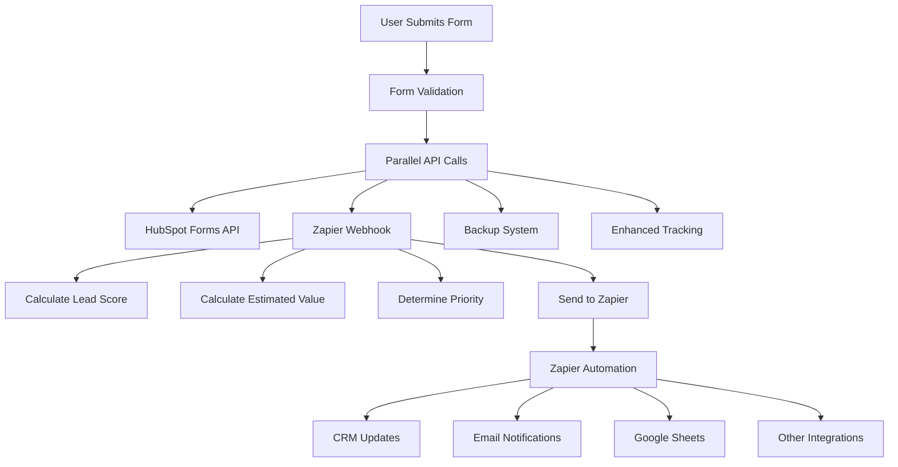

# 🔗 Zapier Webhook Integration

## Overview
The Zapier webhook integration allows automatic processing of lead form submissions through Zapier's automation platform. When a user submits the lead form, data is sent to multiple endpoints including HubSpot, backup systems, tracking APIs, and now **Zapier webhooks**.

## 📊 Integration Details

### Webhook URL
```
https://hooks.zapier.com/hooks/catch/23446220/uuymrjh/
```

### API Endpoint
```
POST /api/zapier-webhook
```

## 📋 Data Structure

### Input Data (from form)
```typescript
interface ZapierWebhookData {
  name: string;           // Customer name
  email: string;          // Customer email
  phone?: string;         // Customer phone (optional)
  quantity?: string;      // Requested quantity
  leadMagnet?: string;    // Lead magnet name
  timestamp?: string;     // Submission timestamp
  url?: string;           // Page URL
  referrer?: string;      // Referrer URL
  utm_source?: string;    // UTM source
  utm_medium?: string;    // UTM medium
  utm_campaign?: string;  // UTM campaign
  utm_term?: string;      // UTM term
  utm_content?: string;   // UTM content
  userAgent?: string;     // Browser user agent
  deviceInfo?: any;       // Device information
  city?: string;          // Detected city
  fbp?: string;           // Facebook browser ID
  fbc?: string;           // Facebook click ID
}
```

### Output Data (sent to Zapier)
```typescript
interface ZapierPayload {
  // Core lead information
  name: string;
  email: string;
  phone: string;
  quantity: string;
  
  // Lead context
  leadMagnet: string;
  message: string;
  
  // Metadata
  timestamp: string;
  source: 'krfof-leadmagnet';
  form_type: 'quote_request';
  
  // Page data
  page_url: string;
  referrer: string;
  user_agent: string;
  
  // Campaign tracking
  utm_source: string;
  utm_medium: string;
  utm_campaign: string;
  utm_term: string;
  utm_content: string;
  
  // Device & location
  device_info: object;
  city: string;
  
  // Facebook attribution
  facebook_browser_id: string;
  facebook_click_id: string;
  
  // Calculated fields
  lead_score: number;        // 0-100 scoring
  estimated_value: number;   // SAR value
  priority: 'high' | 'medium' | 'low';
}
```

## 🎯 Lead Scoring Algorithm

### Base Score: 50 points

### Scoring Factors:
1. **Phone Number** (+20 points)
   - Valid phone number with 5+ digits
   
2. **Quantity** (+10-30 points)
   - 10+ units: +30 points
   - 5-9 units: +20 points
   - 2-4 units: +10 points
   - 1 unit: +0 points

3. **Paid Traffic** (+15 points)
   - UTM source matches: google, facebook, instagram, snapchat, tiktok

4. **Facebook Tracking** (+10 points)
   - Has Facebook browser ID (fbp) or click ID (fbc)

### Maximum Score: 100 points

## 💰 Value Calculation

### Base Price: 340 SAR per unit

### Bulk Discounts:
- **10+ units**: No discount (full price)
- **5-9 units**: 5% discount (0.95 multiplier)
- **2-4 units**: 2% discount (0.98 multiplier)
- **1 unit**: Full price

### Formula:
```javascript
function calculateEstimatedValue(quantity) {
  const qty = parseInt(quantity || '1');
  const pricePerUnit = 340;
  
  if (qty >= 10) return qty * pricePerUnit;
  if (qty >= 5) return qty * pricePerUnit * 0.95;
  if (qty >= 2) return qty * pricePerUnit * 0.98;
  
  return pricePerUnit;
}
```

## 🚨 Priority Classification

### High Priority
- Large quantity (10+ units) **AND**
- Has phone number **AND**
- From paid traffic

### Medium Priority
- Decent quantity (5+ units) **OR**
- Has phone number

### Low Priority
- Small quantity (1-4 units) **AND**
- No phone number

## 🔄 Form Submission Flow



## 🧪 Testing

### Run Test Script
```bash
# Make sure your dev server is running
npm run dev

# Run the test script
node test-zapier-webhook.js
```

### Test Data Example
```json
{
  "name": "أحمد محمد",
  "email": "ahmed.test@example.com",
  "phone": "+966501234567",
  "quantity": "5",
  "utm_source": "google",
  "utm_medium": "cpc",
  "utm_campaign": "riyadh-shelving-2024",
  "city": "riyadh"
}
```

### Expected Results
- **Lead Score**: ~75 points
- **Estimated Value**: ~1,615 SAR
- **Priority**: medium
- **Zapier Status**: 200 OK

## 📊 Monitoring & Debugging

### Console Logs
The form submission includes detailed logging:
```javascript
console.log('✅ Zapier success:', result.value?.status);
console.warn('⚠️ Zapier failed:', result.reason);
```

### Error Handling
- Non-critical: Form continues if Zapier fails
- Backup systems ensure no data loss
- Detailed error logging for debugging

### Health Checks
1. Check Zapier dashboard for new entries
2. Monitor console logs during form submissions
3. Run test script periodically

## 🔧 Configuration

### Environment Variables
No additional environment variables needed. The webhook URL is hardcoded in the API route for security.

### Zapier Setup
1. Create a new Zap in your Zapier dashboard
2. Set trigger to "Webhooks by Zapier"
3. Choose "Catch Hook"
4. Use the provided webhook URL
5. Configure your desired actions (CRM, email, sheets, etc.)

## 🛡️ Security & Privacy

### Data Handling
- All data is sent over HTTPS
- No sensitive data is logged in production
- Facebook tracking data is anonymized
- IP addresses are not stored long-term

### Error Recovery
- Failed webhook calls don't stop form submission
- Multiple backup systems ensure data integrity
- Comprehensive logging for troubleshooting

## 📈 Analytics Integration

### Tracking Events
The Zapier webhook includes rich data for analytics:
- Campaign attribution (UTM parameters)
- Device and browser information
- Geographic data (city-level)
- User behavior metrics
- Facebook attribution data

### Reporting Capabilities
- Lead source analysis
- Conversion tracking
- ROI calculation
- Geographic performance
- Device/platform insights

## 🔄 Automation Possibilities

With this rich data structure, you can set up Zapier automations for:

1. **CRM Integration**
   - Automatically create/update contacts
   - Set lead scores and priorities
   - Assign to sales representatives based on location

2. **Email Marketing**
   - Add to email sequences
   - Segment by lead score and quantity
   - Personalized follow-up campaigns

3. **Notifications**
   - Slack/Teams alerts for high-priority leads
   - SMS notifications for urgent requests
   - Email notifications to sales team

4. **Data Storage**
   - Google Sheets backup
   - Database synchronization
   - Analytics platform integration

5. **Follow-up Actions**
   - Schedule calendar appointments
   - Create tasks in project management tools
   - Trigger retargeting campaigns

## 📞 Support

For issues with the Zapier integration:
1. Check the test script results
2. Review console logs during form submission
3. Verify Zapier webhook URL is correct
4. Check Zapier dashboard for error messages
5. Monitor the backup systems for data integrity

## 🔄 Updates & Maintenance

### Regular Tasks
- Monitor Zapier webhook success rate
- Review lead scoring accuracy
- Update value calculations as needed
- Test form submissions monthly

### Version History
- **v1.0**: Initial Zapier webhook integration
- **v1.1**: Added lead scoring and value calculation
- **v1.2**: Enhanced error handling and logging 